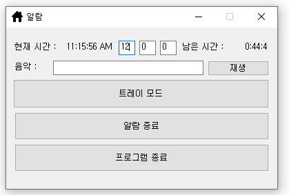
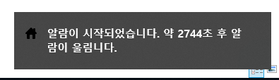

# Computer-Alarm

알람

## Download

- [Windows x86 zip file](./build/alarm_x86_0.0.1.exe?raw=true)

## Info

- 사용자가 지정한 음악을 정해진 시간에 울리도록 합니다.
- 작업표시줄 아이콘으로 최소화 됩니다.
  
  

- 정해진 시간에 말풍선으로 표시합니다.
  
  

## System Requirements

- Windows 10에서 정상작동하는 것을 확인하였습니다.

## How to Install

- zip파일을 다운로드 받고 압축을 해제 합니다.

## How to Delete

- 압축 해제한 폴더를 지우거나 프로그램을 지우면 됩니다.

## What did you learn?

- VB.NET을 배울 수 있었습니다.
- 시간을 계산하는 방법을 배웠습니다.
- 작업표시줄 아이콘으로 축소하는 방법을 배웠습니다.
  
## Finally

- 컴퓨터를 켜놓고 자는 경우가 많아 알람기능이 필요해서 구현했습니다.
- 사용방법은 다소 불편할 수 있습니다.
- 기회가 된다면 업데이트 하겠습니다.

## Modify Content

- 2015-02-17 ( 0.0.1 )
  - 기능 구현

## Copyright

- 비상업적 용도로 사용 가능하며 링크를 반드시 포함해주세요.
- 문제가 되는 내용이 있다면 언제든지 [`issue`](https://github.com/Sotaneum/Computer-Alarm/issues/new), [`Pull requests`](https://github.com/Sotaneum/Computer-Alarm/compare) 부탁드립니다.